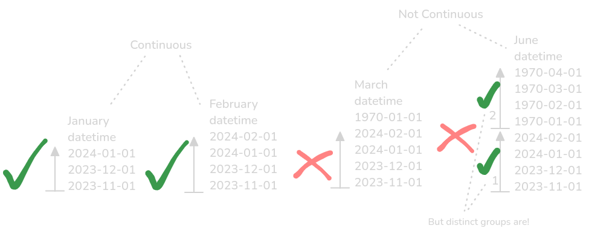

```{r, include = FALSE}
knitr::opts_chunk$set(
  collapse = TRUE,
  comment = "#>"
)
```

# **Active work in progress!**

# Summary

Unnoticed changes in data streams or published datasets can have unintended consequences.

Environmental sensor behaviour during failure, calibration, or software updates is not consistent across sensors. This can affect measurement frequency or jumps in time. At the same time, some sensors are intentionally designed to have variable measurement frequency.

Other unnoticed changed in data can occur in previously published data. These can be revised after initial publication, due to discovery of an inconsistency or error, a change in methodology or instrument re-calibration. Unintended consequences include Digital Object Identifier (DOI) invalidation, or altering future predictions if used as input in forecasting models. This is especially relevant when using other data to generate your own. To maintain data provenance, it is crucial to reference the exact version of the data used.

But what if you are not aware of upstream changes to your input data? Monitoring data sources for these changes is not always possible. Here we present butterfly, an R package for the verification of continually updating timeseries data where we expect new values, but want to ensure previous data remains unchanged, and measurement frequency is maintained as expected.

The intention of butterfly is to check for changes in previously published data, and warn the user with a report that contains as much details as possible. This will allow them to stop unintended data transfer, revise their published data, release a new version and communicate the significance of the change to their users.

# Statement of Need

Semantic versioning is widely adopted in research software [@preston-werner_2024], but as outlined above a published dataset can also change for a number of reasons. It is therefore important to cite the exact version of data you are using in your research to maintain reproducibility [@klump_2021]. If there are any changes this should be indicated to users, with an explanation of what that change is, and why it is significant. 

To ensure trustworthiness butterfly is designed to provide monitoring of unexpected changes as part of an automated data processing pipeline, or as part of an Information Management Frameworks for Digital Twins [@siddorn_2022]. A digital twin might rely on any number of source data, whether live sensor streams or environmental forecasting models. To achieve a FAIR implementation [@wilkinson_2016] of a Digital Twin, data provenance must be maintained, clearly documented for users and available in machine-readable format.

The underlying functionality is largely based on the waldo package, and it also follows waldo's philosophy of being as verbose as possible [@wickham_2024].

## Case Study #1: Automated Data Processing Pipelines

Consider an input/output (I/O) data pipeline where data is fetched from an external source, a calculation is done, and the output is transferred to a different location.

```{r simple_example, out.width = '100%', fig.align='center', echo = FALSE, fig.cap="A simple diagram showing the steps in a generic data pipeline."}

```

The pipeline is used to calculate the **'Amundsen Sea Low Index'**, or ASLI. The Amundsen Seas Low (ASL) is a climatological low pressure system located in the Pacific sector of the Southern Ocean.

The Amundsen Seas Low (ASL) is a climatological low pressure system located in the Pacific sector of the Southern Ocean.The position and strength of the ASL are crucial for understanding regional change over West Antarctica [@hosking_2016]. To calculate the ASL indices and generate our dataset, we use ERA5's mean sea-level pressure data [@hersbach_2020]. The location of the ASL itself is an input parameter which improves other environmental forecasting models. Because of this, we want to continually publish the ASL location in conjuction with ERA5 releases.

In our case, we run this pipeline on a monthly basis:

```{r bas_example, out.width = '100%', fig.align='center', echo = FALSE, fig.cap="A diagram showing the steps in our British Antarctic Survey data pipeline to calculate and publish the Amundsen Sea Low Index dataset."}
knitr::include_graphics("img/bas_example.png")
```

The challenge with [ERA5](https://cds.climate.copernicus.eu/datasets/reanalysis-era5-single-levels?tab=documentation)'s initial release data, ERA5T, is overwritten with the final ERA5 data two months after the month in question. Usually ERA5 and ERA5T are identical, but an issue with input data can (for example for [09/21 - 12/21](https://confluence.ecmwf.int/display/CKB/ERA5T+issue+in+snow+depth), and [07/24](https://forum.ecmwf.int/t/final-validated-era5-product-to-differ-from-era5t-in-july-2024/6685)) force a recalculation, meaning previously published data differs from the final product.

Continually appending **and** publishing requires robust quality assurance. Any change in any change in previous ERA5 data will also change the results of all our previous ASL calculations. If this happened and we overwrite our dataset, we are changing values in an dataset that is already publish. If we append our existing dataset, anyone attempting to reproduce our methods will get different results, because previous calculations are not based on the same version of ERA5. Either way, our DOI will be invalidated.

```{r butterfly_diagram, echo=FALSE, out.width="100%", fig.cap="An illustration of continually updating timeseries data where a previous value unexpectedly changes."}
knitr::include_graphics("img/butterfly_diagram.png")
```

In our case however, we want to continually append ERA5-derived ASL calculations **and** continually publish them. This would be useful when functioning as a data source for an environmental digital twin [@blair_2023], or simply as input data into an environmental forecasting model which itself is frequently running.

To maintain the integrity of our published dataset, we need to impose robust checks to ensure our new results match our published data, where we expect it to.

```{r full_example, out.width = '100%', fig.align='center', echo = FALSE, fig.cap="A diagram showing the steps in our British Antarctic Survey data pipeline to calculate and publish the Amundsen Sea Low Index dataset, while using butterfly to check for unexpected changes in our results."}
knitr::include_graphics("img/full_pipeline_example.png")
```

This is where butterfly is used in a data processing pipeline, to prevent unintended DOI invalidation through publishing datasets with unnoticed changes.

## Case Study 2: unexpected changes in data acquisition

Environmental sensors have different behaviours when they have a power failure. During power failure an internal clock can reset to "1970-01-01", or the manufacturing date: a Raspberry Pi manufactured in 2021 will return to "2021-01-01", but if manufactured in 2022 it returns to "2022-01-01". If we are automatically ingesting and processing this data, an indication that a time series is no longer continuous in the way we expect it to be is a must. We can also mistake new data as "previous" data. This can have consequences for any calculation happening downstream.

```{r timeseries_diagram, echo=FALSE, out.width="100%", fig.cap="An illustration of timeseries data not being continuous in the way it is expected to be."}

```

To prevent writing different ways of checking for this depending on the instrument, the `butterfly::timeline()` function is provided. It will return TRUE/FALSE depending on whether a time series is deemed continuous, based on an expected time step between each measurement. 

### Variable measurement frequencies

A non-continuous timeseries can also be intentional, for example when there is temporal variability in the measurements taken depending on events. At BAS, we collect data from a penguin weighbridge on weighbridge on Bird Island, South Georgia. This weighbridge measure weight on two different load cells (scales) to determine penguin weight and direction [@afanasyev_2015].

The weighbridge does not collect continuous measurements. When no weight is detected on the load cells, it only samples at 1hz, but as soon as any change in weight is detected it will start collecting data at 100hz. This is to reduce the sheer volume of data to process, but also has another benefit in isolating individual penguin crossings.

The individual crossings are the most valuables pieces of data, as these allow deducing information like weight, direction (from colony to sea, or sea to colony) and ultimately, diet.

In this case separating distinct, but continuous segments of data is required. This is the reasoning behind `timeline_group()`. This function allows us to split our timeseries in groups of individual crossings.

## Using butterfly in an operational data pipeline

We use the functionality in this package in an automated data processing pipeline to detect changes, stop data transfer and notify the user. The full methods are described in this [article](https://thomaszwagerman.github.io/butterfly/articles/butterfly_in_pipeline.html) and source code is available in the [asli-pipeline repository](https://github.com/antarctica/asli-pipeline) [@zwagerman_2024]

# Acknowledgements
This software was supported by NERC Grant ... I would like to thank Paul Breen & Helen Peat for guidance on DOIs and data publication, Matt Gascoyne for sharing his work on Bird Island's penguin weighbridge and David Wilby & Scott Hosking for collaborating with me on the Amundsen Sea Low related software development. 

# References

